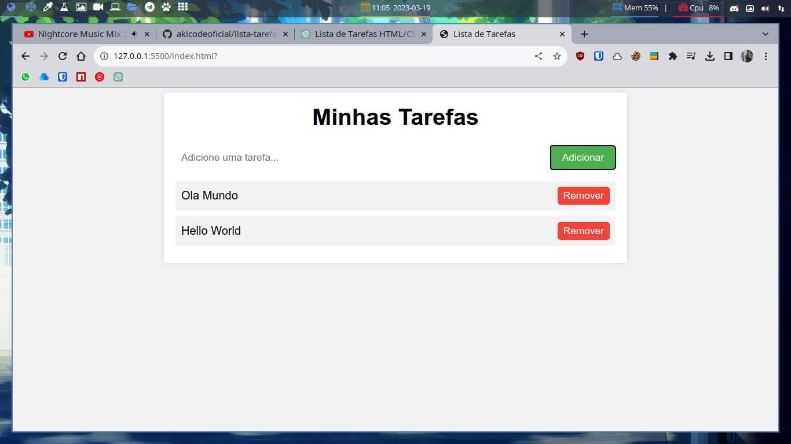

# Lista de Tarefas

Este é um projeto simples que demonstra como criar uma lista de tarefas básica usando HTML, CSS e JavaScript.

A página inclui um formulário onde o usuário pode adicionar novas tarefas à lista. Cada item da lista exibe o nome da tarefa e um botão para removê-la. A lista de tarefas é armazenada na memória do navegador, então as tarefas adicionadas permanecerão na lista mesmo depois de atualizar a página.

Este projeto é uma ótima introdução ao desenvolvimento front-end para iniciantes, ou uma ótima prática para desenvolvedores mais experientes. Sinta-se à vontade para usá-lo como base para seus próprios projetos.

## Como Usar

Para usar este projeto, basta clonar este repositório em sua máquina local e abrir o arquivo `index.html` em seu navegador de preferência. Você também pode hospedar o projeto em um servidor web e acessá-lo pela internet.

## Contribuições

Não estou recebendo Contribuições para este projeto.

## Licença Pùblica

Este projeto é distribuído sob a licença Mozilla. Sinta-se à vontade para usá-lo como quiser.

